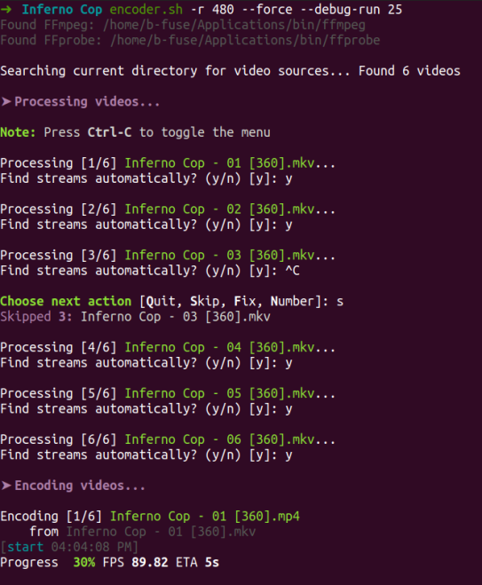

# Video Batch Encoder Script
...with interactive prompts for the non-cli savvy (or if you don't feel like writing them)

## Requirements
 - A working Bash v4+ interpreter with usual coreutils some other misc utils. 
 - FFmpeg/FFprobe
 - Either a \*nix environment
     - Or WSL (Windows Subsystem for Linux) with `ffmpeg.exe` and `ffprobe.exe` in your PATH

## Screenshot


## Usage
Display this by running `encoder.sh --help`
```
USAGE
    encoder.sh [sub | dub] [-r RES] [-a] [-s SOURCE] [-d DEST] [-R]
               [--burn-subs] [--watermark FILE] [--clean] [--force]
               [-w] [--watch-rescan] [--verbose-streams] [--fatal]
               [--debug-run [DUR]] [--version]
    encoder.sh -h | --help

DESCRIPTION
    Encode all MKV and AVI videos in the current
    directory (or subdirectories) to MP4 videos.
    Options are either set via optional arguments
    listed below or interactive prompts in the
    absence of such arguments.

OPTIONS
    -r, --resolution RES
        RES can be one of 240, 360, 480, 640, 720,
        1080, or original. Original by default.

    -a, --auto, --no-auto
        Automatically determine appropriate audio
        and video streams. Implies --burn-subs
        in the absence of --no-burn-subs. Prompts
        by default.

    --burn-subs, --no-burn-subs
        Burn subtitles. Prompts by default.

    -s, --source DIR
        Source directory for encodes. Defaults to
        current directory.

    -d, --destination DIR
        Destination directory for all encodes.
        Will create the directory it it doesn't
        already exist. Defaults to source
        directory.

    -w, --watch
        Watch source directory recursively for new 
        videos.

    --version
        Print version.

    -h, --help
        Show simplfied help.

    --help-advanced, --help-debug, --help-all
        Show help from advanced sections.
```

## Known issues
 - `sub`/`dub` are implemented, but aren't guaranteed to work 100% of the time
 - List of issues TODO at the top of the Bash script

## Credits
Authored by b-fuze (Mike32) with amazing help and testing from awesome AU members.

